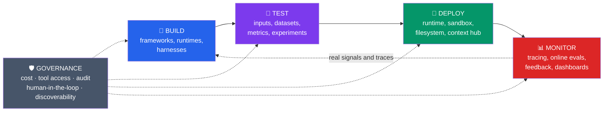

# AI Agent Development Methodology

> Personal methodology notes for designing, building, evaluating, deploying and operating AI agents in production, organized around the **Build → Test → Deploy → Monitor → (Build...)** cycle.

This repository is not documentation for a specific tool. It is a personal mental map: every time I learn something new about how to build agents reliably, I add it to the appropriate section. The goal is that, a year from now, this will be a quick reference for "how I decide X when building an agent" — not a collection of scattered links.

## Why a cycle and not a list of steps

An agent is never "done". You build a version, test it, deploy it in a controlled way, observe how it behaves with real traffic, and that generates the material (hard cases, failures, traces) that feeds the next build iteration. Treating this as a closed cycle — and not as a linear project with an end — is the difference between a demo that works once and a system that improves over time.

Governance is not a fifth phase: it wraps the other four. When there is a single agent, light controls are enough. When there are dozens, without governance the system becomes impossible to audit, expensive and opaque.

## Sections index

| Phase | What it covers | Page |
|---|---|---|
| 🔨 **Build** | Frameworks vs. runtimes vs. harnesses, required level of control, no-code vs. code-first | [`docs/01-build.md`](docs/01-build.md) |
| 🧪 **Test** | Inputs, datasets, metrics, experiments, multi-turn simulations | [`docs/02-test.md`](docs/02-test.md) |
| 🚀 **Deploy** | Production runtime, sandboxes, virtual filesystem, context hub | [`docs/03-deploy.md`](docs/03-deploy.md) |
| 📊 **Monitor** | Tracing, online evals, signals, feedback, dashboards and alerts | [`docs/04-monitor.md`](docs/04-monitor.md) |
| 🛡️ **Governance** | Cost, tool access, audit, human-in-the-loop, discoverability | [`docs/05-governance.md`](docs/05-governance.md) |
| ☁️ **AWS Mapping** | Summary table of which AWS service covers each part of the cycle | [`docs/06-aws-mapping.md`](docs/06-aws-mapping.md) |
| 📓 **Glossary** | Terms that were hard to understand the first time (dogfooding trace, context hub, etc.) | [`docs/07-glosario.md`](docs/07-glosario.md) |

## How to use this repo

- Each page in `docs/` is independent: you can read one without having read the others.
- The pages have a **"Key decisions"** section — these are the questions I ask myself in every real project before choosing a tool or approach.
- The pages have an **"AWS Connection"** section — how I materialize each concept if the stack is AWS (the main cloud I use). If I switch clouds, this is the section to rewrite; the rest of the methodology is cloud-agnostic.
- Anything I am not 100% clear on is marked with 🚧 — these are living notes, not settled truths.

## Origin and references

The structure of the Build → Test → Deploy → Monitor → Govern cycle is inspired by a talk/article from LangChain ("The Agent Development Lifecycle", Harrison Chase, 2026) and by Anthropic's approach to agent evaluation ("Demystifying evals for AI agents"). Full references are at the bottom of each page.

---

*Last updated: see commit history. Personal notes repo — not official documentation for any product.*
