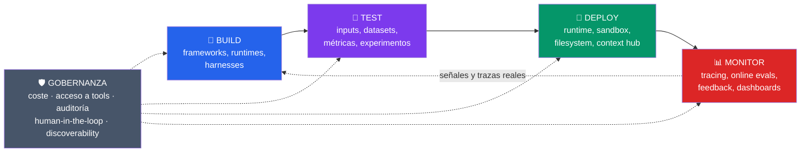

# Metodología de Desarrollo de Agentes de IA

> Notas personales de metodología para diseñar, construir, evaluar, desplegar y operar agentes de IA en producción, organizadas alrededor del ciclo **Build → Test → Deploy → Monitor → (Build...)**.

Este repositorio no es documentación de una herramienta concreta. Es un mapa mental propio: cada vez que aprenda algo nuevo sobre cómo construir agentes de forma fiable, lo añado a la sección que corresponda. La idea es que dentro de un año esto sea una referencia rápida de "cómo decido X cuando construyo un agente", no una colección de enlaces sueltos.

## Por qué un ciclo y no una lista de pasos

Un agente no se "termina". Se construye una versión, se prueba, se despliega de forma controlada, se observa cómo se comporta con tráfico real, y eso genera el material (casos difíciles, fallos, trazas) que alimenta la siguiente vuelta de construcción. Tratar esto como un ciclo cerrado — y no como un proyecto lineal con un final — es la diferencia entre un demo que funciona una vez y un sistema que mejora con el tiempo.

La gobernanza no es una quinta fase: envuelve a las cuatro. Cuando hay un solo agente, unos controles ligeros bastan. Cuando hay decenas, sin gobernanza el sistema se vuelve imposible de auditar, caro y opaco.

## Índice de secciones

| Fase | Qué cubre | Página |
|---|---|---|
| 🔨 **Build** | Frameworks vs. runtimes vs. harnesses, nivel de control necesario, no-code vs. code-first | [`docs/01-build.md`](docs/01-build.md) |
| 🧪 **Test** | Inputs, datasets, métricas, experimentos, simulaciones multi-turno | [`docs/02-test.md`](docs/02-test.md) |
| 🚀 **Deploy** | Runtime de producción, sandboxes, virtual filesystem, context hub | [`docs/03-deploy.md`](docs/03-deploy.md) |
| 📊 **Monitor** | Tracing, online evals, señales, feedback, dashboards y alertas | [`docs/04-monitor.md`](docs/04-monitor.md) |
| 🛡️ **Governance** | Coste, acceso a herramientas, auditoría, human-in-the-loop, discoverability | [`docs/05-governance.md`](docs/05-governance.md) |
| ☁️ **AWS Mapping** | Tabla resumen de qué servicio de AWS cubre cada pieza del ciclo | [`docs/06-aws-mapping.md`](docs/06-aws-mapping.md) |
| 📓 **Glosario** | Términos que me costó entender la primera vez (dogfooding trace, context hub, etc.) | [`docs/07-glosario.md`](docs/07-glosario.md) |

## Cómo usar este repo

- Cada página de `docs/` es independiente: se puede leer una sola sin haber leído las demás.
- Las páginas tienen una sección **"Preguntas para decidir"** — son las preguntas que me hago en cada proyecto real antes de elegir herramienta o enfoque.
- Las páginas tienen una sección **"Conexión con AWS"** — cómo materializo cada concepto si el stack es AWS (principal cloud que uso). Si cambio de cloud, esta es la sección a reescribir; el resto de la metodología es agnóstica.
- Todo lo que no tengo claro al 100% lo marco con 🚧 — son notas vivas, no verdades cerradas.

## Origen y referencias

La estructura del ciclo Build → Test → Deploy → Monitor → Govern está inspirada en una charla/artículo de LangChain ("The Agent Development Lifecycle", Harrison Chase, 2026) y en el enfoque de evaluación de agentes de Anthropic ("Demystifying evals for AI agents"). Las referencias completas están al final de cada página.

---

*Última actualización: ver historial de commits. Repo personal de notas — no es documentación oficial de ningún producto.*
