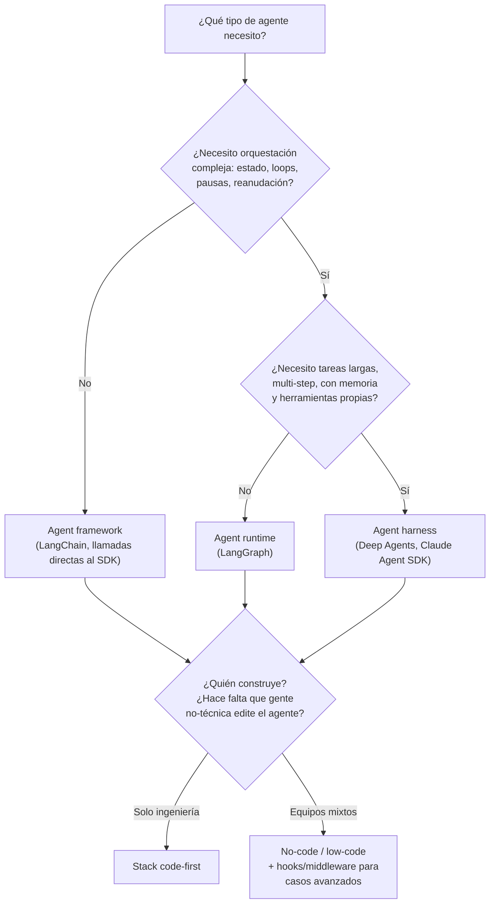

# 🔨 Build

[← Volver al índice](../README.md) · Siguiente: [🧪 Test →](02-test.md)

## La idea central

Construir un agente no es una sola decisión, son varias decisiones apiladas en capas distintas. La pregunta que de verdad importa al empezar no es "¿qué framework uso?" sino **"¿cuánto control necesito sobre cada capa, y quién en el equipo necesita tocar cada una?"**

Cuanto más control quiero (sobre el bucle del agente, el estado, los reintentos, los permisos), más código tengo que escribir y más capas tengo que entender. Cuanto menos control necesito, más puedo apoyarme en abstracciones de alto nivel o en herramientas no-code. Ninguno de los dos extremos es "el correcto" — depende de la complejidad real de la tarea y de quién va a mantener esto.

## Las tres capas: framework, runtime, harness

Esta distinción es la que más me costó interiorizar, porque en el día a día se usan estos términos casi como sinónimos. No lo son, y elegir mal la capa lleva a sobre-ingeniería (montar un runtime completo para un tool-calling loop simple) o a infra-ingeniería (intentar meter un agente largo y con estado dentro de algo pensado para una sola llamada).

### Agent frameworks — el "qué"
Se centran en **abstracciones**: ayudan a componer llamadas al modelo, herramientas, prompts, retrieval y salidas estructuradas. Resuelven el problema de "no quiero escribir el boilerplate de llamar al LLM y parsear la respuesta cada vez".

- Ejemplos: LangChain, CrewAI.
- Encaja cuando: la tarea es esencialmente una secuencia de llamadas a modelo + herramientas, sin necesidad de pausar/reanudar ni de estado complejo persistente.

### Agent runtimes — el "cómo se ejecuta"
Se centran en **ejecución**: estado, control de flujo, durabilidad, intervención humana. Si el agente necesita ramificarse, hacer loops, pausarse a mitad de tarea y reanudar más tarde sin perder el progreso, esto es lo que falta en un framework normal.

- Ejemplo claro: LangGraph.
- Encaja cuando: tareas largas, multi-paso, donde perder el progreso a mitad de camino (por un fallo de red o un timeout) sale caro, o donde necesitas que un humano apruebe un paso antes de continuar.

### Agent harnesses — el entorno de trabajo completo
Se centran en **hacer**: dan al agente la estructura que necesita para tareas largas — prompts, skills, servidores MCP, hooks, middleware y, a veces, un sistema de archivos propio.

- Ejemplos: Deep Agents, Claude Agent SDK.
- Encaja cuando: el agente necesita comportarse más como "un colaborador con un entorno de trabajo" que como "una función que devuelve texto" — por ejemplo, agentes de código, de investigación, o agentes que generan y consultan sus propios archivos intermedios.

> 🚧 Nota personal: en la práctica, muchos proyectos mezclan capas — un harness montado sobre un runtime, expuesto a través de un framework para integrarlo con el resto del backend. No pasa nada por mezclar, lo importante es saber **qué capa resuelve qué problema** para no buscar la solución en el sitio equivocado.

## Build no-code / low-code

No todo el build tiene que ser código. Herramientas como interfaces de construcción visual (tipo LangSmith Fleet, Claude Cowork, n8n) permiten que gente que entiende el flujo de trabajo de negocio — pero no programa — participe directamente en construir el agente. Esto importa porque **la persona que entiende la tarea no siempre es la persona que escribe el código**, y forzar ese cuello de botella ralentiza todo.

Pero el no-code no elimina la necesidad de control de ingeniería. A medida que el sistema crece, hacen falta puntos de extensión en código: **hooks y middleware** para añadir lógica alrededor de llamadas a herramientas, manejo de contexto, aprobaciones, autenticación o reglas de negocio — sin tener que reconstruir el agente entero cada vez.

El mejor entorno de build hace que lo simple sea simple (un experto de dominio edita un prompt o una skill sin tocar código) y lo complejo sea posible (un ingeniero mete una regla de negocio compleja vía middleware) — a la vez.

## Preguntas para decidir

Antes de elegir herramienta, me hago estas preguntas:

1. **¿La tarea es de un solo turno o necesita estado a través del tiempo?** Un solo turno → framework. Estado persistente, pausas, reanudación → runtime.
2. **¿Necesito que el agente "viva" en un entorno de trabajo (archivos, skills, memoria) o solo necesito que responda?** Si necesita entorno → harness.
3. **¿Quién va a tocar esto después de la v1?** Si hay personas no técnicas que necesitan ajustar comportamiento (prompts, políticas), necesito una capa no-code o al menos contexto separado del código (ver [Deploy → Context Hub](03-deploy.md#context-hub)).
4. **¿Cuánto control necesito sobre reintentos, permisos, y el bucle del agente en sí?** Más control → más código, capas más bajas. Menos control → abstracciones de más alto nivel.
5. **¿Esto va a escalar a muchos agentes dentro de la organización?** Si sí, pensar ya en estandarizar el stack de build para no acabar con N frameworks distintos sin gobernanza compartida (ver [Governance](05-governance.md)).

## Conexión con AWS

En AWS, el equivalente directo de "harness + runtime gestionado" es **Amazon Bedrock AgentCore Runtime**: ejecuta el agente (de cualquier framework — LangGraph, CrewAI, Strands, etc.) en sesiones aisladas (microVMs), sin que yo tenga que gestionar infraestructura de bajo nivel.

- Si quiero **framework**: sigo usando LangChain, CrewAI o el SDK que prefiera tal cual; AWS no impone una capa de abstracción aquí — AgentCore es agnóstico de framework.
- Si quiero **runtime con estado y durabilidad**: LangGraph (o Strands Agents) por encima, desplegado sobre AgentCore Runtime para la parte de ejecución gestionada, aislamiento de sesión y reanudación.
- Si quiero **harness con herramientas propias conectadas a sistemas reales**: AgentCore Gateway convierte APIs, funciones Lambda o specs OpenAPI en herramientas que el agente puede usar sin tener que escribir integraciones a mano — es el equivalente AWS de "conectar MCP servers" en la fase de build.
- Para **no-code / build colaborativo**: no hay un equivalente nativo de AWS tan directo como Fleet o Cowork; aquí suelo recurrir a herramientas externas o a una capa propia ligera sobre Bedrock.

## Referencias

- LangChain — [The Agent Development Lifecycle](https://www.langchain.com/blog/the-agent-development-lifecycle) (Harrison Chase, 2026)
- [Amazon Bedrock AgentCore — Overview](https://docs.aws.amazon.com/bedrock-agentcore/latest/devguide/what-is-bedrock-agentcore.html)
