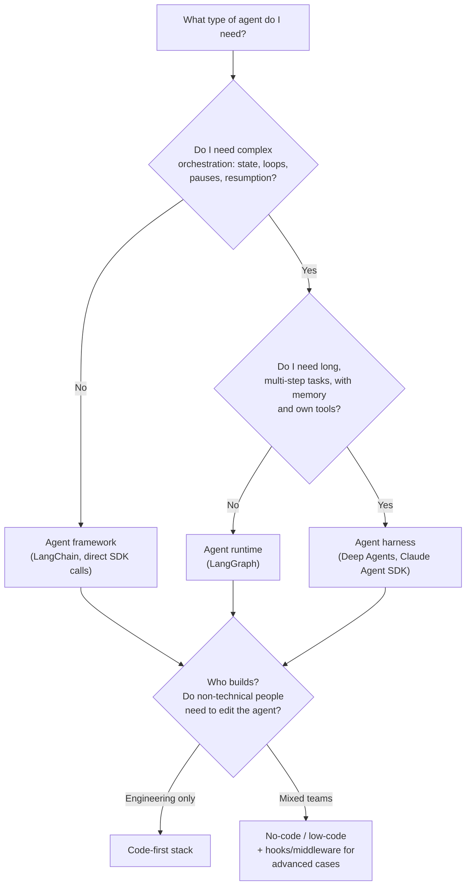

# 🔨 Build

[← Back to index](../README.md) · Next: [🧪 Test →](02-test.md)

## The core idea

Building an agent is not a single decision — it is several decisions stacked in distinct layers. The question that really matters at the start is not "which framework do I use?" but **"how much control do I need over each layer, and who on the team needs to touch each one?"**

The more control I want (over the agent loop, state, retries, permissions), the more code I have to write and the more layers I have to understand. The less control I need, the more I can rely on high-level abstractions or no-code tools. Neither extreme is "the right one" — it depends on the actual complexity of the task and on who will maintain this.

## The three layers: framework, runtime, harness

This distinction is the one that took me longest to internalize, because in day-to-day work these terms are used almost as synonyms. They are not, and choosing the wrong layer leads to over-engineering (setting up a full runtime for a simple tool-calling loop) or under-engineering (trying to fit a long, stateful agent inside something designed for a single call).

### Agent frameworks — the "what"
They focus on **abstractions**: they help compose model calls, tools, prompts, retrieval and structured outputs. They solve the problem of "I don't want to write the boilerplate to call the LLM and parse the response every time".

- Examples: LangChain, CrewAI.
- Fits when: the task is essentially a sequence of model + tool calls, with no need to pause/resume or maintain complex persistent state.

### Agent runtimes — the "how it runs"
They focus on **execution**: state, control flow, durability, human intervention. If the agent needs to branch, loop, pause mid-task and resume later without losing progress, this is what a normal framework lacks.

- Clear example: LangGraph.
- Fits when: long, multi-step tasks where losing progress mid-way (due to a network failure or a timeout) is costly, or where a human needs to approve a step before continuing.

### Agent harnesses — the complete work environment
They focus on **doing**: they give the agent the structure it needs for long tasks — prompts, skills, MCP servers, hooks, middleware and sometimes its own filesystem.

- Examples: Deep Agents, Claude Agent SDK.
- Fits when: the agent needs to behave more like "a collaborator with a work environment" than "a function that returns text" — for example, coding agents, research agents, or agents that generate and consult their own intermediate files.

> 🚧 Personal note: in practice, many projects mix layers — a harness built on top of a runtime, exposed through a framework to integrate with the rest of the backend. Mixing is fine; what matters is knowing **which layer solves which problem** so you don't look for the solution in the wrong place.

## No-code / low-code build

Not all build work has to be code. Tools like visual build interfaces (e.g., LangSmith Fleet, Claude Cowork, n8n) allow people who understand the business workflow — but do not code — to participate directly in building the agent. This matters because **the person who understands the task is not always the person who writes the code**, and forcing that bottleneck slows everything down.

But no-code does not eliminate the need for engineering control. As the system grows, code extension points are needed: **hooks and middleware** to add logic around tool calls, context handling, approvals, authentication or business rules — without having to rebuild the entire agent each time.

The best build environment makes simple things simple (a domain expert edits a prompt or a skill without touching code) and complex things possible (an engineer adds a complex business rule via middleware) — at the same time.

## Key decisions

Before choosing a tool, I ask myself these questions:

1. **Is the task single-turn or does it need state over time?** Single-turn → framework. Persistent state, pauses, resumption → runtime.
2. **Does the agent need to "live" in a work environment (files, skills, memory) or just respond?** If it needs an environment → harness.
3. **Who will touch this after v1?** If non-technical people need to adjust behavior (prompts, policies), I need a no-code layer or at least context separated from code (see [Deploy → Context Hub](03-deploy.md#context-hub--managing-prompts-and-context-separately-from-code)).
4. **How much control do I need over retries, permissions, and the agent loop itself?** More control → more code, lower layers. Less control → higher-level abstractions.
5. **Will this scale to many agents within the organization?** If yes, think about standardizing the build stack now to avoid ending up with N different frameworks and no shared governance (see [Governance](05-governance.md)).

## AWS Connection

In AWS, the direct equivalent of "managed harness + runtime" is **Amazon Bedrock AgentCore Runtime**: it runs the agent (from any framework — LangGraph, CrewAI, Strands, etc.) in isolated sessions (microVMs), without me having to manage low-level infrastructure.

- If I want a **framework**: I keep using LangChain, CrewAI or whichever SDK I prefer as-is; AWS does not impose an abstraction layer here — AgentCore is framework-agnostic.
- If I want a **runtime with state and durability**: LangGraph (or Strands Agents) on top, deployed on AgentCore Runtime for the managed execution, session isolation and resumption.
- If I want a **harness with own tools connected to real systems**: AgentCore Gateway converts APIs, Lambda functions or OpenAPI specs into tools the agent can use without writing integrations by hand — it is the AWS equivalent of "connecting MCP servers" in the build phase.
- For **no-code / collaborative build**: there is no native AWS equivalent as direct as Fleet or Cowork; here I usually resort to external tools or a lightweight custom layer on top of Bedrock.

## References

- LangChain — [The Agent Development Lifecycle](https://www.langchain.com/blog/the-agent-development-lifecycle) (Harrison Chase, 2026)
- [Amazon Bedrock AgentCore — Overview](https://docs.aws.amazon.com/bedrock-agentcore/latest/devguide/what-is-bedrock-agentcore.html)
