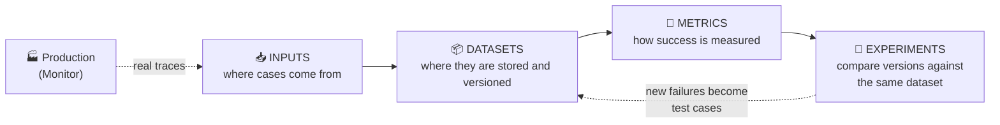

# 🧪 Test

[← Build](01-build.md) · [Back to index](../README.md) · Next: [🚀 Deploy →](03-deploy.md)

## The core idea

You don't need a perfect eval suite before anyone uses the agent — that is almost never realistic. What you need is **enough evals to catch obvious failures, compare versions, and not deploy changes blindly**. Testing quality grows over time: start with a handful of representative cases and reinforce it with what surfaces in production.

Testing agents is different from testing traditional software for a fundamental reason: behavior is **non-deterministic**. The same task may succeed 90% of the time and fail the remaining 10%. A single pass/fail result tells you almost nothing — you need to think in distributions, not booleans.

## The four pieces: Inputs, Datasets, Metrics, Experiments

### Inputs — where test cases come from

Not all test cases are born equal or cost the same to obtain. Typical sources, from least to most "realistic":

- **Expected tasks** — the cases I myself anticipate the agent must handle well. This is the mandatory starting point: if I don't cover this, I have no baseline at all.
- **Edge cases** — boundary situations I know (or suspect) break normal behavior: ambiguous inputs, missing data, unexpected formats.
- **Dogfooding trace** — a trace captured while the team itself (or internal users) uses the agent genuinely, not as a synthetic test. The difference from an "invented" case is that a dogfooding trace reflects how the agent is *actually* used, with all the real ambiguity of human language. It is usually the most valuable source of cases in early stages, before having real production traffic.
- **Simulations** — simulated end-to-end interactions, typically multi-turn (see below). Useful when you cannot or do not want to wait for real traffic to discover long-conversation failures.

> The natural progression is: I start with expected tasks + edge cases I invent myself; as soon as I have dogfooding, I incorporate it; as soon as I have real production (see [Monitor](04-monitor.md)), production traces become the dominant source.

### Datasets — how cases are preserved

A dataset is the way to **not lose what has already been learned**. Without datasets, the same failure reappears after every prompt change, model change, or tool update — because no one remembers to retest that specific case.

- **Examples** — the "normal" cases, representative of expected usage. They serve as the baseline for correct behavior.
- **Hard cases** — the cases that are genuinely difficult: those that at some point caused the agent to fail. These deliver the most value per case included.
- **Regression coverage** — the subset of cases (usually the hard cases already resolved) that gets re-run on every change to ensure an improvement in one place doesn't break something that was already working elsewhere. It is literally "regression tests", the same as in traditional software, but applied to agent behavior: every time I fix a real failure, that case enters regression coverage permanently. If I don't do this, the same errors resurface cycle after cycle.

### Metrics — how success is measured

The right metric depends on the type of task, and there is an important distinction here:

- **With clear ground truth**: did it extract the correct value? Did it choose the correct label? Did it update the correct field? These tasks are measured by **direct correctness** (exact match, comparison against reference).
- **Without a unique ground truth**: writing a response, summarizing a conversation, deciding whether to escalate, completing a task with multiple valid paths. Here there is no single "correct" answer, so you resort to **criteria-based evaluation**: is the response grounded? Did it follow the policy? Did it ask for clarification when it should? Did it complete the task without unnecessary tool calls?

> 🚧 The "efficiency" criterion (not making unnecessary tool calls) is easy to overlook but matters a lot for cost — see [Governance → Cost](05-governance.md#cost--the-first-governance-challenge).

### Experiments — what connects datasets and metrics with iteration

An experiment is running the same dataset against a variation: different prompt, different model, different retrieval strategy, different tool schema, different orchestration approach. The goal is to compare versions in a controlled way and see, over time, whether the agent improves or degrades.

Without structured experiments, any change is evaluated "by eye" — and that is exactly what a dataset + metrics is designed to avoid.

## Simulations — why single-turn testing isn't enough

Many agents are multi-turn systems: they don't answer a question and finish, they maintain a conversation, gather information, call tools, update state and recover from ambiguity. For these agents, a single-turn eval doesn't detect failures that only appear three or four turns later.

Examples of where this matters:
- A voice agent, the most obvious case.
- A support agent that has to handle a frustrated customer, ask follow-up questions, check an order's status and decide whether to escalate.
- A coding agent that has to inspect a repository, make changes, run tests and respond to feedback.
- An internal operations agent that needs to gather missing information before acting.

For these cases you need **multi-turn evals and end-to-end simulations** — checking the response to a single isolated input is not enough.

## Key decisions

1. **Do I have ground truth or not?** This defines whether I measure by direct correctness or by criteria.
2. **Is the agent single-turn or conversational?** If conversational, I need multi-turn simulation, not just point-in-time evals.
3. **Where do I get the first 10–20 cases?** If I have nothing, I start with expected tasks + invented edge cases; I don't wait for production before starting to test.
4. **Is this failure I just fixed already in regression coverage?** If not, I add it now — before I forget.
5. **Am I comparing as an experiment or just "trying things out"?** If I'm going to change something (model, prompt, retrieval), I run it as an experiment against the existing dataset, not as a loose test without comparison.

## AWS Connection

**Amazon Bedrock AgentCore Evaluations** (GA since 2026) is the piece that covers almost everything in this chapter in a managed way:

- **Datasets** — AgentCore Dataset management allows versioning sets of scenarios (each can be multi-turn) as a managed resource, referenceable by ID and version from a CI/CD pipeline, replicating exactly the concept of regression coverage.
- **Metrics** — AgentCore offers built-in evaluators (identified as `Builtin.EvaluatorName`) for response quality, safety, task completion and correct tool use, plus support for **ground truth**: reference answers, session-level behavior assertions, and expected tool call sequences.
- **Experiments** — The **on-demand evaluation** (via API or the **on-demand evaluation dataset runner**) is designed exactly for this: running the same dataset against each build in CI/CD, comparing models or prompts against each other, and blocking deployment if the score falls below a threshold.
- If the stack already uses LangGraph/LangChain instead of (or in addition to) native AgentCore, **LangSmith** covers the same ground (datasets, experiments, side-by-side comparison) independently of AWS, and can coexist with an AgentCore Runtime deployment.
- For evaluating a single model (without a full agent: just the LLM) there is also the **Bedrock Model Evaluation job** (accuracy, robustness, toxicity) — but this is a model development loop tool, not a substitute for an agent evaluation suite: it does not cover correct tool invocation or Knowledge Base retrieval quality.

## References

- Anthropic — [Demystifying evals for AI agents](https://www.anthropic.com/engineering/demystifying-evals-for-ai-agents)
- LangChain — [The Agent Development Lifecycle](https://www.langchain.com/blog/the-agent-development-lifecycle)
- AWS — [Evaluate agent performance with Amazon Bedrock AgentCore Evaluations](https://docs.aws.amazon.com/bedrock-agentcore/latest/devguide/evaluations.html)
- AWS — [Build a test suite that grows with your agent with dataset management in Amazon Bedrock AgentCore](https://aws.amazon.com/blogs/machine-learning/build-a-test-suite-that-grows-with-your-agent-with-dataset-management-in-amazon-bedrock-agentcore/)
