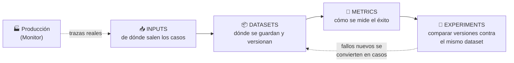

# 🧪 Test

[← Build](01-build.md) · [Volver al índice](../README.md) · Siguiente: [🚀 Deploy →](03-deploy.md)

## La idea central

No hace falta una suite de evals perfecta antes de que nadie use el agente — eso casi nunca es realista. Lo que hace falta es tener **suficientes evals para detectar fallos obvios, comparar versiones, y no desplegar cambios a ciegas**. La calidad del testing crece con el tiempo: empieza con un puñado de casos representativos y se va reforzando con lo que aparece en producción.

El testing de agentes es distinto al testing de software tradicional por una razón de fondo: el comportamiento es **no determinista**. La misma tarea puede tener éxito el 90% de las veces y fallar el 10% restante. Un solo resultado pass/fail no dice casi nada — hace falta pensar en distribuciones, no en booleanos.

## Las cuatro piezas: Inputs, Datasets, Metrics, Experiments

### Inputs — de dónde salen los casos de prueba

No todos los casos de prueba nacen igual ni cuestan igual de obtener. Las fuentes típicas, de menor a mayor "realismo":

- **Expected tasks** — los casos que yo mismo anticipo que el agente tiene que resolver bien. Es el punto de partida obligatorio: si no cubro esto, no tengo ni una línea base.
- **Edge cases** — situaciones límite que sé (o sospecho) que rompen el comportamiento normal: inputs ambiguos, datos faltantes, formatos inesperados.
- **Dogfooding trace** — una traza capturada mientras el propio equipo (o usuarios internos) usa el agente de forma genuina, no como test sintético. La diferencia con un caso "inventado" es que el dogfooding trace refleja cómo se usa el agente *de verdad*, con toda la ambigüedad real del lenguaje humano. Suele ser la fuente de casos más valiosa en fases tempranas, antes de tener tráfico de producción real.
- **Simulations** — interacciones simuladas de extremo a extremo, normalmente multi-turno (ver más abajo). Útiles cuando no se puede o no se quiere esperar a tráfico real para descubrir fallos de conversación larga.

> La progresión natural es: empiezo con expected tasks + edge cases que invento yo; en cuanto tengo dogfooding, lo incorporo; en cuanto tengo producción real (ver [Monitor](04-monitor.md)), las trazas de producción pasan a ser la fuente dominante.

### Datasets — cómo se preservan los casos

Un dataset es la forma de **no perder lo que ya se aprendió**. Sin datasets, el mismo fallo reaparece después de cada cambio de prompt, de modelo, o de actualización de una herramienta — porque nadie se acuerda de volver a probar ese caso concreto.

- **Examples** — los casos "normales", representativos del uso esperado. Sirven de línea base de comportamiento correcto.
- **Hard cases** — los casos que de verdad cuestan: los que en algún momento hicieron fallar al agente. Estos son los que más valor aportan por caso incluido.
- **Regression coverage** — el subconjunto de casos (normalmente los hard cases ya resueltos) que se vuelve a correr en cada cambio para asegurar que una mejora en un sitio no rompe algo que ya funcionaba en otro. Es literalmente "tests de regresión", igual que en software tradicional, pero aplicado a comportamiento de agente: cada vez que arreglo un fallo real, ese caso entra en regression coverage para siempre. Si no hago esto, los mismos errores vuelven a aparecer ciclo tras ciclo.

### Metrics — cómo se mide el éxito

La métrica correcta depende del tipo de tarea, y aquí hay una distinción importante:

- **Con ground truth claro**: ¿extrajo el valor correcto? ¿eligió la etiqueta correcta? ¿actualizó el campo correcto? Estas tareas se miden por **corrección directa** (exact match, comparación contra referencia).
- **Sin ground truth único**: escribir una respuesta, resumir una conversación, decidir si escalar, completar una tarea con múltiples caminos válidos. Aquí no hay "la" respuesta correcta, así que se recurre a **evaluación por criterios**: ¿la respuesta está fundamentada (grounded)? ¿siguió la política? ¿pidió aclaración cuando debía? ¿completó la tarea sin llamadas a herramientas innecesarias?

> 🚧 El criterio de "eficiencia" (no hacer llamadas a herramientas de más) es fácil de pasar por alto pero importa mucho en coste — ver [Governance → Cost](05-governance.md#cost).

### Experiments — lo que conecta datasets y métricas con la iteración

Un experimento es correr el mismo dataset contra una variación: distinto prompt, distinto modelo, distinta estrategia de retrieval, distinto esquema de herramienta, distinta forma de orquestar. El objetivo es comparar versiones de forma controlada y ver, con el tiempo, si el agente mejora o empeora.

Sin experimentos estructurados, cualquier cambio se evalúa "a ojo" — y eso es exactamente lo que un dataset + métricas está diseñado para evitar.

## Simulations — por qué el testing de un solo turno no basta

Muchos agentes son sistemas multi-turno: no responden una pregunta y terminan, sino que mantienen una conversación, recopilan información, llaman herramientas, actualizan estado y se recuperan de la ambigüedad. Para estos agentes, un eval de un solo turno no detecta fallos que solo aparecen tres o cuatro turnos después.

Ejemplos de dónde esto importa:
- Un agente de voz, el caso más obvio.
- Un agente de soporte que tiene que manejar a un cliente frustrado, hacer preguntas de seguimiento, comprobar el estado de un pedido y decidir si escalar.
- Un agente de código que tiene que inspeccionar un repositorio, hacer cambios, correr tests y responder a feedback.
- Un agente de operaciones internas que necesita reunir información que falta antes de actuar.

Para estos casos hacen falta **evals multi-turno y simulaciones de extremo a extremo** — no basta con comprobar la respuesta a un único input aislado.

## Preguntas para decidir

1. **¿Tengo ground truth o no?** Define si mido por corrección directa o por criterios.
2. **¿El agente es de un solo turno o conversacional?** Si es conversacional, necesito simulación multi-turno, no solo evals puntuales.
3. **¿De dónde saco los primeros 10-20 casos?** Si no tengo nada, empiezo con expected tasks + edge cases inventados; no espero a tener producción para empezar a testear.
4. **¿Este fallo que acabo de arreglar está ya en regression coverage?** Si no, lo añado ahora — antes de que se me olvide.
5. **¿Estoy comparando como experimento o solo "probando a ver qué pasa"?** Si voy a cambiar algo (modelo, prompt, retrieval), lo corro como experimento contra el dataset existente, no como prueba suelta sin comparación.

## Conexión con AWS

**Amazon Bedrock AgentCore Evaluations** (GA desde 2026) es la pieza que cubre casi todo este capítulo de forma gestionada:

- **Datasets** — Dataset management de AgentCore permite versionar conjuntos de escenarios (cada uno puede ser multi-turno) como recurso gestionado, referenciable por ID y versión desde un pipeline de CI/CD, replicando justo el concepto de regression coverage.
- **Metrics** — AgentCore ofrece evaluadores integrados (built-in evaluators, identificados como `Builtin.NombreEvaluador`) para calidad de respuesta, seguridad, finalización de tarea y uso correcto de herramientas, además de soporte para **ground truth**: respuestas de referencia, aserciones de comportamiento a nivel de sesión, y secuencias esperadas de llamadas a herramientas.
- **Experiments** — La **on-demand evaluation** (vía API o el **on-demand evaluation dataset runner**) está pensada exactamente para esto: correr el mismo dataset contra cada build en CI/CD, comparar modelos o prompts entre sí, y bloquear el despliegue si la puntuación cae por debajo de un umbral.
- Si el stack ya usa LangGraph/LangChain en lugar de (o además de) AgentCore nativo, **LangSmith** cubre el mismo terreno (datasets, experiments, comparación lado a lado) de forma independiente de AWS, y puede convivir con un despliegue en AgentCore Runtime.
- Para evaluación de un único modelo (sin agente completo: solo el LLM) existe también el **Bedrock Model Evaluation job** (accuracy, robustez, toxicidad) — pero es una herramienta de bucle de desarrollo de modelo, no sustituye una suite de evaluación de agente: no cubre invocación correcta de herramientas ni calidad de retrieval de una Knowledge Base.

## Referencias

- Anthropic — [Demystifying evals for AI agents](https://www.anthropic.com/engineering/demystifying-evals-for-ai-agents)
- LangChain — [The Agent Development Lifecycle](https://www.langchain.com/blog/the-agent-development-lifecycle)
- AWS — [Evaluate agent performance with Amazon Bedrock AgentCore Evaluations](https://docs.aws.amazon.com/bedrock-agentcore/latest/devguide/evaluations.html)
- AWS — [Build a test suite that grows with your agent with dataset management in Amazon Bedrock AgentCore](https://aws.amazon.com/blogs/machine-learning/build-a-test-suite-that-grows-with-your-agent-with-dataset-management-in-amazon-bedrock-agentcore/)
