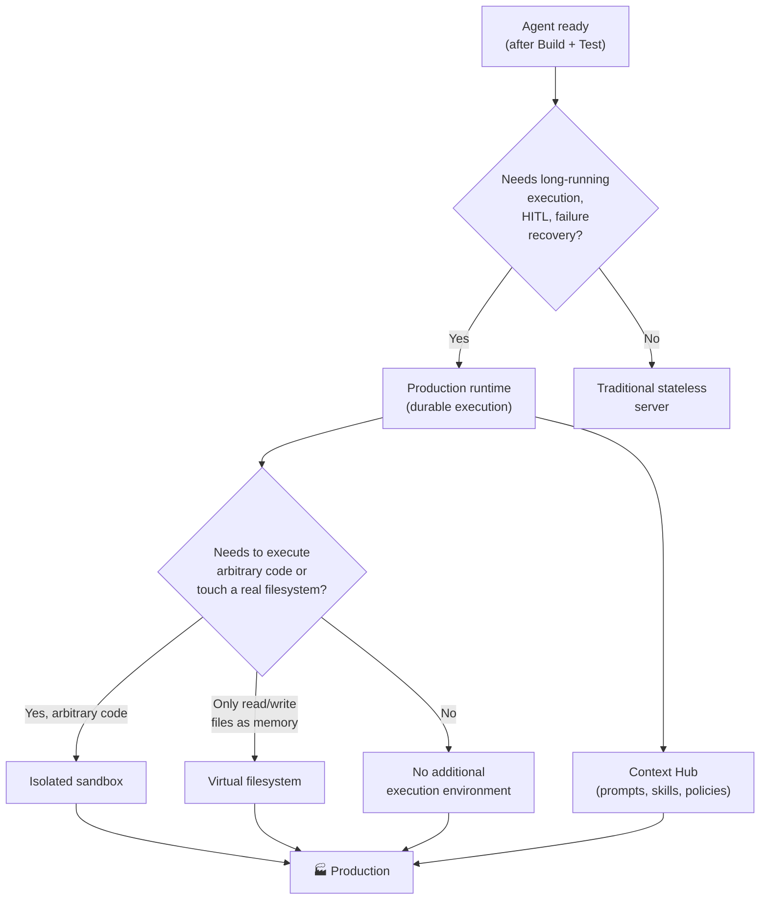

# 🚀 Deploy

[← Test](02-test.md) · [Back to index](../README.md) · Next: [📊 Monitor →](04-monitor.md)

## The core idea

For a simple agent, deployment looks a lot like a traditional stateless application. But most agents worth the effort need more than a stateless server: they run for extended periods, call tools, wait for human input, write files, recover from interruptions and maintain state across different interactions or tasks.

That means deploying an agent is not just "pushing it to a server". It means giving the agent the **runtime**, the **execution environment** and the **context management systems** it needs to do real work.

## Runtime — the foundation of execution

A production agent runtime typically needs to support two things:

- **Durable execution**: the agent can save checkpoints of its progress and resume, instead of losing work when something fails mid-task. This matters especially for long tasks: if a tool call fails at step 8 of 12, I don't want to restart from step 1.
- **Human-in-the-loop**: the agent can pause when it needs human approval, clarification or review, and resume exactly where it left off.

There are already-built solutions for this instead of building the infrastructure from scratch: managed deployment platforms for agents based on frameworks like LangGraph or Deep Agents, managed cloud-provider runtimes, or building on top of long-running workflow orchestration systems (like Temporal) when the team already uses them for something else.

## Sandboxes — dedicated execution environments

More and more agents need to write code, execute it, inspect files, transform documents or interact with a filesystem. When that happens, you must decide **where** that work takes place. A sandbox is an isolated execution environment with filesystem access that reduces the blast radius of an error or unsafe behavior — if the code the agent executes does something wrong, the damage is contained within the sandbox.

Not every agent needs a full sandbox. The key question is: **does the agent need to execute arbitrary code, or does it only need somewhere to store and retrieve files?**

## Virtual filesystem — when a full sandbox isn't needed

Sometimes it is enough to give the agent a *virtual* filesystem: the agent can read, write and organize files as working memory, without necessarily executing arbitrary code inside an isolated sandbox. Under the hood, that filesystem can be backed by normal storage systems (relational databases, object storage), but from the agent's perspective it behaves like folders and files with operations like `ls`, `read_file`, `write_file`, `edit_file`, `glob`, `grep`.

Why would an agent want "files" instead of just sending everything in the prompt context? Because it allows:
- Storing large intermediate results outside the active context (and bringing them back only when needed).
- Maintaining a conversation or work history organized in something navigable.
- Giving the agent a way to structure its own work (notes, drafts, partial results) just as a person would with a project folder.

> This is different from a sandbox: here the risk of "arbitrary code running uncontrolled" does not exist, because no code is executed — only files are read and written. It is a lighter and cheaper option when the agent does not need to run scripts.

## Context Hub — managing prompts and context separately from code

This is the part of deploy that is easiest to overlook, and the one with the most practical impact on real iteration speed.

Some of the most important parts of an agent **are not traditional application code**: prompts, retrieval context, skills, task instructions. These pieces:
- Change more frequently than application code.
- Often need to be edited by people who are not engineers (domain experts, support, product).

This creates the need for a **context hub (or prompt hub)**: a place to store, version, review and update the "non-code" parts of the agent, separate from the application code repository.

What does the team gain from this?
- Agent behavior can be adjusted **without a full application deployment** — changing a prompt or a policy should not require a full app CI/CD pipeline.
- Domain experts can own the context they understand best, without depending on an engineer for every wording change.
- Context can be **versioned and tagged** just like code (which version of a prompt is in production, which is in staging), and a history of who changed what and when can be maintained.
- Context repositories can be **composed**: an "agent" repo with its high-level instructions (configuration, tool list) linking to one or more reusable "skill" repos (an email formatting procedure, a code review guide) — so a well-built skill gets reused across agents instead of being rewritten each time.

> 🚧 The idea that "context needs a home separate from code" strikes me as the least obvious and most useful observation in the entire deploy cycle. It is easy to embed prompts as strings inside app code — and that works until someone without repo access needs to change one.

## Key decisions

1. **Can the agent lose its progress if something fails mid-task, or is that unacceptable?** If unacceptable, I need durable execution with checkpoints, not a stateless server.
2. **Are there steps that require human approval before continuing?** If yes, the runtime must support human-in-the-loop pause/resumption natively, not as a patch.
3. **Does the agent execute arbitrary code, or does it only read/write files as working memory?** Arbitrary code → sandbox. Only files → virtual filesystem is enough and cheaper.
4. **Who will change prompts, skills or policies after launch?** If there is someone without code repo access who needs to adjust behavior, I need a context hub from day one, not as an afterthought.
5. **Does this skill/prompt already exist in another agent on the team?** Before writing a new one, I check whether something reusable already exists in the shared context hub (see [Governance → Discoverability](05-governance.md#discoverability--the-third-challenge)).

## AWS Connection

- **Runtime** → **Amazon Bedrock AgentCore Runtime**. Each agent session runs in its own isolated microVM (separate CPU, memory and filesystem from any other session); when the session ends, the microVM is destroyed and memory is sanitized. Supports asynchronous and long-running processing, with session lifecycle management, versioning and endpoints. Works with any framework (LangGraph, CrewAI, Strands, etc.) and supports MCP and A2A.
- **Sandbox / code execution** → **AgentCore Code Interpreter** (Python and other language execution in an isolated environment, with support for large files referenced in S3) and **AgentCore Browser** (managed browser, isolated at VM level, for the agent to interact with web pages). Alternatives outside AWS: Daytona, E2B.
- **Virtual filesystem** → there is no dedicated AWS service with that exact name; in practice this is built with a storage backend (S3, or a database as backing store) behind the harness filesystem tools (e.g., Deep Agents backends: `StateBackend`, `FilesystemBackend`, `CompositeBackend`).
- **Context Hub** → in the LangChain ecosystem this is literally **LangSmith Context Hub** (versioned context repos, with `hub pull` to bring a pinned version to an environment, and backends like `ContextHubBackend` that mount it as a virtual filesystem inside Deep Agents). Within pure AWS, the closest equivalent is using **AWS AppConfig** or a dedicated context Git repo (separate from the code repo) combined with S3/Parameter Store to serve the active version to the runtime — there is no (as of this note) native AWS service with the exact same proposition as Context Hub.
- **Connecting external tools** → **AgentCore Gateway**, which converts APIs, Lambda functions or OpenAPI specs into MCP-compatible tools without rewriting integrations.
- **Identity and permissions when calling tools** → **AgentCore Identity**, which manages tokens and permissions when the agent accesses external services (OAuth) or AWS resources, on behalf of the user or on its own.

## References

- LangChain — [The Agent Development Lifecycle](https://www.langchain.com/blog/the-agent-development-lifecycle)
- LangChain — [Introducing LangSmith Context Hub](https://www.langchain.com/blog/introducing-context-hub)
- LangChain — [Deep Agents: Backends (virtual filesystem)](https://docs.langchain.com/oss/python/deepagents/backends)
- AWS — [Amazon Bedrock AgentCore — Overview](https://docs.aws.amazon.com/bedrock-agentcore/latest/devguide/what-is-bedrock-agentcore.html)
- AWS — [Amazon Bedrock AgentCore FAQs](https://aws.amazon.com/bedrock/agentcore/faqs/)
