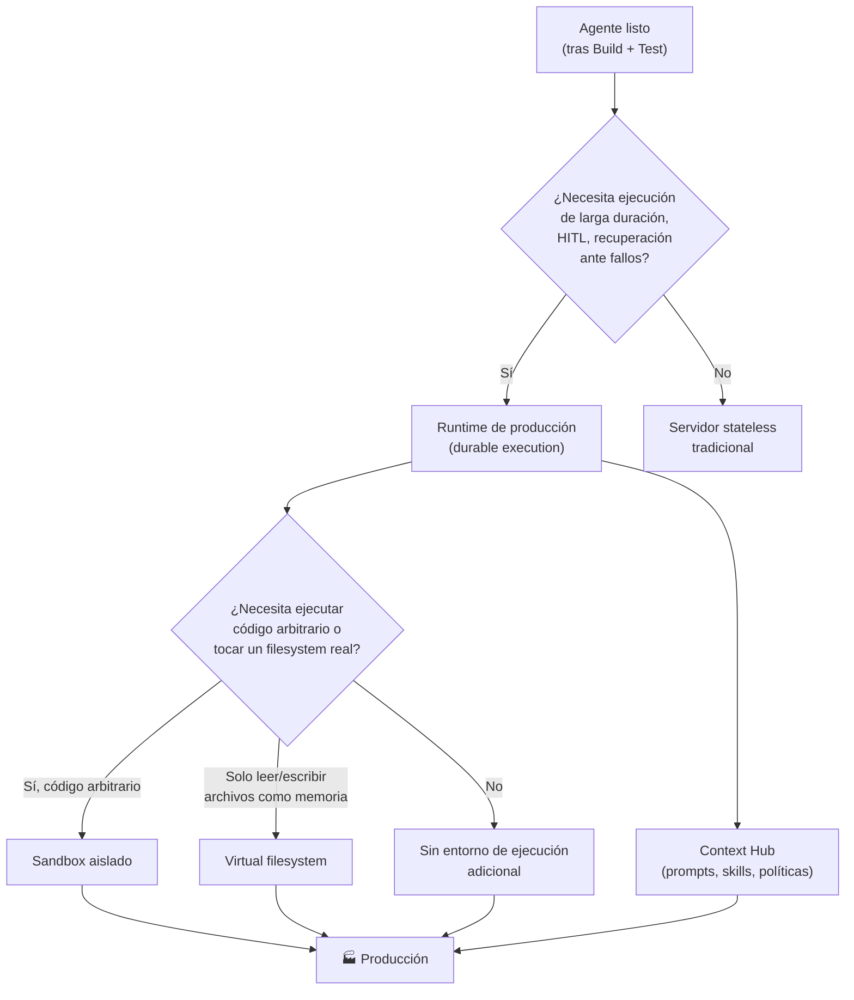

# 🚀 Deploy

[← Test](02-test.md) · [Volver al índice](../README.md) · Siguiente: [📊 Monitor →](04-monitor.md)

## La idea central

Para un agente simple, el despliegue se parece bastante al de una aplicación tradicional sin estado. Pero la mayoría de agentes con los que vale la pena molestarse necesitan más que un servidor sin estado: se ejecutan durante periodos largos, llaman herramientas, esperan input humano, escriben archivos, se recuperan de interrupciones y mantienen estado entre interacciones o tareas distintas.

Eso significa que desplegar un agente no es solo "subirlo a un servidor". Es darle al agente el **runtime**, el **entorno de ejecución** y los **sistemas de gestión de contexto** que necesita para hacer trabajo real.

## Runtime — la base de la ejecución

Un runtime de agentes en producción típicamente necesita soportar dos cosas:

- **Ejecución durable**: el agente puede guardar checkpoints de su progreso y reanudar, en lugar de perder el trabajo cuando algo falla a mitad de camino. Esto importa especialmente en tareas largas: si una llamada a una herramienta falla en el paso 8 de 12, no quiero volver a empezar desde el paso 1.
- **Human-in-the-loop**: el agente puede pausarse cuando necesita aprobación, aclaración o revisión humana, y reanudar exactamente donde lo dejó.

Hay soluciones ya construidas para esto en lugar de montar la infraestructura desde cero: plataformas de despliegue gestionado para agentes basados en frameworks como LangGraph o Deep Agents, runtimes gestionados de cloud providers, o construir sobre sistemas de orquestación de workflows de larga duración (como Temporal) cuando el equipo ya los usa para otra cosa.

## Sandboxes — entornos de ejecución dedicados

Cada vez más agentes necesitan escribir código, ejecutarlo, inspeccionar archivos, transformar documentos o interactuar con un sistema de archivos. Cuando eso pasa, hay que decidir **dónde** ocurre ese trabajo. Un sandbox es un entorno de ejecución aislado con acceso a filesystem que reduce el radio de impacto de un error o un comportamiento inseguro — si el código que ejecuta el agente hace algo mal, el daño queda contenido dentro del sandbox.

No todos los agentes necesitan un sandbox completo. La pregunta clave es: **¿el agente necesita ejecutar código arbitrario, o solo necesita un sitio donde guardar y recuperar archivos?**

## Virtual filesystem — cuando no hace falta un sandbox completo

A veces basta con dar al agente un sistema de archivos *virtual*: el agente puede leer, escribir y organizar archivos como memoria de trabajo, sin necesariamente ejecutar código arbitrario dentro de un sandbox. Por debajo, ese filesystem puede estar respaldado por sistemas normales de almacenamiento (bases de datos relacionales, almacenamiento de objetos), pero de cara al agente se comporta como carpetas y archivos con operaciones tipo `ls`, `read_file`, `write_file`, `edit_file`, `glob`, `grep`.

¿Por qué un agente querría "archivos" en lugar de simplemente mandar todo en el contexto del prompt? Porque permite:
- Guardar resultados intermedios grandes fuera del contexto activo (y traerlos de vuelta solo cuando hacen falta).
- Mantener un historial de conversación o de trabajo organizado en algo navegable.
- Dar al agente una forma de estructurar su propio trabajo (notas, borradores, resultados parciales) igual que lo haría una persona con una carpeta de proyecto.

> Esto es distinto de un sandbox: aquí el riesgo de "código arbitrario ejecutándose sin control" no existe, porque no se ejecuta código — solo se leen y escriben archivos. Es una opción más ligera y más barata cuando el agente no necesita correr scripts.

## Context Hub — gestionar prompts y contexto como un sistema aparte del código

Esta es la parte de deploy que más fácil es pasar por alto, y la que más impacto práctico tiene en la velocidad real de iteración.

Algunas de las partes más importantes de un agente **no son código de aplicación tradicional**: prompts, contexto de retrieval, skills, instrucciones de tarea. Estas piezas:
- Cambian con más frecuencia que el código de la aplicación.
- A menudo necesitan ser editadas por personas que no son ingenieras (expertos de dominio, soporte, producto).

Esto crea la necesidad de un **hub de contexto (o de prompts)**: un sitio para guardar, versionar, revisar y actualizar las partes "no-código" del agente, separado del repositorio de código de la aplicación.

¿Qué gana el equipo con esto?
- Se puede ajustar el comportamiento del agente **sin un despliegue completo** de la aplicación — cambiar un prompt o una política no debería requerir un pipeline de CI/CD de la app entera.
- Los expertos de dominio pueden ser dueños del contexto que mejor entienden, sin depender de un ingeniero para cada cambio de redacción.
- El contexto se puede **versionar y etiquetar** igual que el código (qué versión de un prompt está en producción, cuál en staging), y se puede mantener historial de quién cambió qué y cuándo.
- Se pueden **componer** repos de contexto: un repo "agente" con sus instrucciones de alto nivel (configuración, lista de herramientas) que enlaza a uno o varios repos "skill" reutilizables (un procedimiento de formateo de email, una guía de revisión de código) — así una skill bien hecha se reutiliza entre agentes en lugar de reescribirse cada vez.

> 🚧 La idea de "el contexto necesita una casa distinta del código" me parece la observación menos obvia y más útil de todo el ciclo de deploy. Es fácil meter los prompts como strings dentro del código de la app — y eso funciona hasta que alguien sin acceso al repo necesita cambiar uno.

## Preguntas para decidir

1. **¿El agente puede perder su progreso si algo falla a mitad de tarea, o eso es inaceptable?** Si es inaceptable, necesito ejecución durable con checkpoints, no un servidor sin estado.
2. **¿Hay pasos que requieren aprobación humana antes de continuar?** Si sí, el runtime tiene que soportar pausa/reanudación human-in-the-loop de forma nativa, no como parche.
3. **¿El agente ejecuta código arbitrario, o solo lee/escribe archivos como memoria de trabajo?** Código arbitrario → sandbox. Solo archivos → virtual filesystem es suficiente y más barato.
4. **¿Quién va a cambiar los prompts, skills o políticas después del lanzamiento?** Si hay alguien sin acceso al repo de código que necesita ajustar comportamiento, necesito un context hub desde el día uno, no como añadido posterior.
5. **¿Esta skill/prompt ya existe en otro agente del equipo?** Antes de escribir uno nuevo, miro si ya hay algo reutilizable en el context hub compartido (ver [Governance → Discoverability](05-governance.md#discoverability)).

## Conexión con AWS

- **Runtime** → **Amazon Bedrock AgentCore Runtime**. Cada sesión de agente corre en su propia microVM aislada (CPU, memoria y filesystem separados de cualquier otra sesión); al terminar la sesión, la microVM se destruye y la memoria se sanitiza. Soporta procesamiento asíncrono y de larga duración, con gestión de ciclo de vida de sesión, versionado y endpoints. Funciona con cualquier framework (LangGraph, CrewAI, Strands, etc.) y soporta MCP y A2A.
- **Sandbox / ejecución de código** → **AgentCore Code Interpreter** (ejecución de Python y otros lenguajes en un entorno aislado, con soporte de archivos a gran escala referenciados en S3) y **AgentCore Browser** (navegador gestionado, aislado a nivel de VM, para que el agente interactúe con páginas web). Alternativas fuera de AWS: Daytona, E2B.
- **Virtual filesystem** → no hay un servicio AWS dedicado con ese nombre exacto; en la práctica esto se construye con un backend de almacenamiento (S3, o una base de datos como respaldo) detrás de las herramientas de filesystem del harness (p. ej. los backends de Deep Agents: `StateBackend`, `FilesystemBackend`, `CompositeBackend`).
- **Context Hub** → en el ecosistema LangChain esto es literalmente **LangSmith Context Hub** (repos de contexto versionados, con `hub pull` para traer una versión fijada a un entorno, y backends como `ContextHubBackend` que lo montan como filesystem virtual dentro de Deep Agents). Dentro de AWS puro, lo más cercano es usar **AWS AppConfig** o un repo de Git dedicado a contexto (separado del repo de código) combinado con S3/Parameter Store para servir la versión activa al runtime — no existe (a fecha de esta nota) un servicio nativo de AWS con la misma propuesta exacta que Context Hub.
- **Conectar herramientas externas** → **AgentCore Gateway**, que convierte APIs, funciones Lambda o specs OpenAPI en herramientas MCP-compatibles sin reescribir integraciones.
- **Identidad y permisos al llamar herramientas** → **AgentCore Identity**, que gestiona tokens y permisos cuando el agente accede a servicios externos (OAuth) o a recursos AWS, en nombre del usuario o por sí mismo.

## Referencias

- LangChain — [The Agent Development Lifecycle](https://www.langchain.com/blog/the-agent-development-lifecycle)
- LangChain — [Introducing LangSmith Context Hub](https://www.langchain.com/blog/introducing-context-hub)
- LangChain — [Deep Agents: Backends (virtual filesystem)](https://docs.langchain.com/oss/python/deepagents/backends)
- AWS — [Amazon Bedrock AgentCore — Overview](https://docs.aws.amazon.com/bedrock-agentcore/latest/devguide/what-is-bedrock-agentcore.html)
- AWS — [Amazon Bedrock AgentCore FAQs](https://aws.amazon.com/bedrock/agentcore/faqs/)
