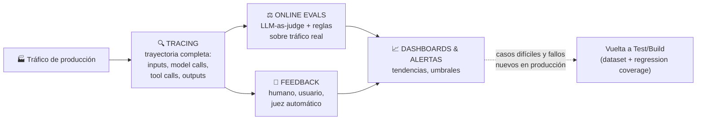

# 📊 Monitor

[← Deploy](03-deploy.md) · [Volver al índice](../README.md) · Siguiente: [🛡️ Governance →](05-governance.md)

## La idea central

Monitorizar agentes es distinto de monitorizar software tradicional. Métricas como latencia, coste, tasa de errores y uptime siguen importando, pero son solo una parte del cuadro. **Un agente puede devolver una respuesta técnicamente exitosa (200 OK, sin excepción) y aun así haber fallado la tarea**: llamó a la herramienta equivocada, se apoyó en el contexto equivocado, se saltó un paso de aprobación obligatorio, o produjo una respuesta que suena plausible pero es incorrecta.

Para detectar esos fallos hace falta algo más granular que un dashboard de infraestructura: hacen falta **trazas**.

## Tracing — la base de todo lo demás

Una traza captura la trayectoria completa del agente: los inputs que recibió, las llamadas al modelo que hizo, las herramientas que invocó, las salidas que recibió de vuelta y la respuesta o acción final que produjo. Este es el nivel de detalle necesario para entender qué hizo el agente *de verdad* — no lo que asumo que hizo.

La idea de fondo (y la razón por la que esto se trata como pieza central, no como "logging más detallado") es que **la observabilidad de agentes es lo que hace posible la evaluación de agentes**: sin poder ver la trayectoria paso a paso, no se puede depurar de forma fiable un comportamiento ni convertir un fallo real en un caso de test futuro. El ciclo de mejora del agente literalmente *empieza* en la traza — es la materia prima de la que salen los nuevos casos para [Test](02-test.md).

## Online evals — señales sobre tráfico real

Monitorizar también significa extraer **señales** de esas trazas de forma sistemática, no solo guardarlas para inspección manual.

- **LLM-as-judge**: un modelo evaluador puntúa si el agente respondió la pregunta del usuario, siguió la política, usó el tono adecuado, o completó la tarea correctamente — sobre tráfico real, sin necesidad de desplegar código nuevo para cada chequeo.
- **Señales simples basadas en reglas**: una expresión regular puede comprobar si apareció una frase obligatoria, si se llamó a una herramienta prohibida, o si ocurrió un patrón de fallo ya conocido. Estas señales son baratas, deterministas, y muchas veces más fiables que un juicio de LLM para casos concretos y bien definidos.

Estas señales no solo sirven para control de calidad. Son también una forma de **analítica de producto**: qué tareas piden los usuarios de verdad, dónde se atascan los agentes, con qué frecuencia los usuarios corrigen al agente, y dónde perciben los usuarios que hay errores.

## Feedback — cerrar el círculo con juicio humano y de usuario

No basta con guardar trazas: hace falta guardar **feedback junto a esas trazas**. El feedback puede venir de jueces LLM, de señales basadas en reglas, de revisores humanos, o de feedback directo del usuario recogido vía API.

Lo importante es la **conexión**: poder atar "el usuario estuvo insatisfecho" a "el agente usó la herramienta equivocada tres pasos antes" en la misma traza. Sin esa conexión, el feedback es ruido suelto sin capacidad de diagnóstico.

## Dashboards y alertas

Finalmente, hacen falta dashboards y alertas que muestren tendencias en el tiempo, no solo el estado del momento. Un dashboard útil de agente trackea: uso, feedback, latencia, coste, llamadas a herramientas, puntuaciones de evaluadores, y patrones de fallo recurrentes.

Las alertas deberían dispararse cuando se cruzan umbrales importantes: latencia subiendo, coste subiendo, herramientas fallando, feedback de usuario cayendo, o picos de violaciones de política.

> Buen monitoreo no es solo saber si el sistema está "up". Es entender si el agente está haciendo el trabajo correcto, de la forma correcta, y mejorando con el tiempo.

## El bucle de vuelta: cómo Monitor alimenta a Build

Los sistemas de monitorización más fuertes alimentan directamente la evaluación: las trazas importantes se convierten en ejemplos de dataset (ver [Test → Inputs](02-test.md#inputs--de-dónde-salen-los-casos-de-prueba)), los fallos recurrentes se convierten en métricas, y el comportamiento de producción se convierte en la base de la siguiente ronda de mejora.

Este es el motivo por el que el ciclo se dibuja como un círculo y no como una línea: lo que se aprende monitorizando se convierte literalmente en los datasets y experimentos de la siguiente vuelta de build/test.

## Preguntas para decidir

1. **¿Puedo reconstruir qué hizo el agente paso a paso para un caso concreto que falló?** Si no, falta tracing — sin esto, todo lo demás (online evals, dashboards) se queda cojo.
2. **¿Mis evaluadores corren también sobre producción, o solo en desarrollo?** Si solo en desarrollo, me estoy perdiendo justo los casos que el dataset offline no anticipó.
3. **¿El feedback (humano o de usuario) está conectado a la traza concreta, o vive suelto en otro sistema?** Si vive suelto, pierdo la capacidad de diagnosticar la causa raíz.
4. **¿Qué umbral, si se cruza, me tiene que despertar de madrugada?** Definir esto explícitamente evita que las alertas sean ruido o, peor, que no existan.
5. **¿Esta traza interesante ya está en mi dataset de regression coverage?** Si detecto un fallo nuevo en producción y no lo llevo de vuelta al dataset, el ciclo se rompe — vuelve a pasar.

## Conexión con AWS

- **Tracing** → **Amazon Bedrock AgentCore Observability**, instrumentado con el SDK de **AWS Distro for OpenTelemetry (ADOT)**. Da métricas, spans y trazas por defecto en **Amazon CloudWatch** para los recursos de runtime, memoria, gateway, herramientas integradas e identidad. Soporta también agentes que corren fuera de AgentCore Runtime, siempre que se instrumenten con ADOT — útil si el runtime de ejecución no es de AWS pero se quiere centralizar observabilidad ahí.
- **Online evals** → **AgentCore Evaluations**, modo *online evaluation*: muestrea y puntúa de forma continua trazas en producción, usando los mismos evaluadores integrados (13 a la fecha de esta nota: calidad de respuesta, seguridad, finalización de tarea, uso de herramientas) que se usan en el modo on-demand para CI/CD (ver [Test](02-test.md#conexión-con-aws)).
- **Dashboards y alertas** → directamente en **CloudWatch**: la página de observabilidad generativa de CloudWatch para las métricas estándar de AgentCore, más alarmas vía `PutMetricAlarm` (por ejemplo, alertar si la tasa de error supera el 5% o la latencia supera 1 segundo).
- **Feedback estructurado** → no hay un servicio AWS nativo equivalente al feedback-adjunto-a-run de LangSmith; en la práctica esto se modela como metadata adicional en los logs/spans de CloudWatch o como un campo de la traza que se envía junto al span vía el SDK de evaluación.
- Si el equipo ya usa LangGraph/Deep Agents sobre AgentCore Runtime, **LangSmith Observability** puede convivir con CloudWatch: LangSmith para trazas detalladas a nivel de agente (estructura de threads, sub-agentes, herramientas) y CloudWatch para la vista de infraestructura/operaciones — no son mutuamente excluyentes.

## Referencias

- LangChain — [The Agent Development Lifecycle](https://www.langchain.com/blog/the-agent-development-lifecycle)
- LangChain — [Agent observability powers agent evaluation](https://www.langchain.com/blog/agent-observability-powers-agent-evaluation)
- LangChain — [The agent improvement loop starts with a trace](https://www.langchain.com/blog/traces-start-agent-improvement-loop)
- AWS — [Add observability to your Amazon Bedrock AgentCore resources](https://docs.aws.amazon.com/bedrock-agentcore/latest/devguide/observability-configure.html)
- AWS — [Amazon Bedrock AgentCore Evaluations is now generally available](https://aws.amazon.com/about-aws/whats-new/2026/03/agentcore-evaluations-generally-available/)
