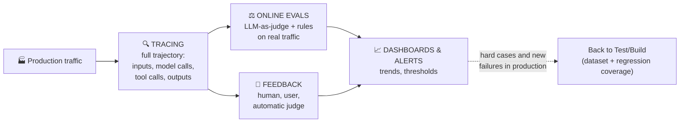

# 📊 Monitor

[← Deploy](03-deploy.md) · [Back to index](../README.md) · Next: [🛡️ Governance →](05-governance.md)

## The core idea

Monitoring agents is different from monitoring traditional software. Metrics like latency, cost, error rate and uptime still matter, but they are only part of the picture. **An agent can return a technically successful response (200 OK, no exception) and still have failed the task**: it called the wrong tool, relied on the wrong context, skipped a mandatory approval step, or produced a response that sounds plausible but is incorrect.

Detecting those failures requires something more granular than an infrastructure dashboard: you need **traces**.

## Tracing — the foundation of everything else

A trace captures the agent's complete trajectory: the inputs it received, the model calls it made, the tools it invoked, the outputs it got back, and the final response or action it produced. This is the level of detail needed to understand what the agent *actually* did — not what I assume it did.

The underlying idea (and the reason this is treated as a central piece, not as "more detailed logging") is that **agent observability is what makes agent evaluation possible**: without being able to see the step-by-step trajectory, you cannot reliably debug behavior or convert a real failure into a future test case. The agent improvement cycle literally *starts* from the trace — it is the raw material from which new cases for [Test](02-test.md) are drawn.

## Online evals — signals on real traffic

Monitoring also means extracting **signals** from those traces systematically, not just storing them for manual inspection.

- **LLM-as-judge**: an evaluator model scores whether the agent answered the user's question, followed the policy, used the right tone, or completed the task correctly — on real traffic, without needing to deploy new code for each check.
- **Simple rule-based signals**: a regular expression can check whether a mandatory phrase appeared, whether a prohibited tool was called, or whether a known failure pattern occurred. These signals are cheap, deterministic, and often more reliable than an LLM judgment for specific, well-defined cases.

These signals are not just for quality control. They are also a form of **product analytics**: what tasks users actually request, where agents get stuck, how often users correct the agent, and where users perceive errors.

## Feedback — closing the loop with human and user judgment

Storing traces is not enough: you need to store **feedback alongside those traces**. Feedback can come from LLM judges, rule-based signals, human reviewers, or direct user feedback collected via API.

What matters is the **connection**: being able to link "the user was unsatisfied" to "the agent used the wrong tool three steps earlier" in the same trace. Without that connection, feedback is loose noise without diagnostic power.

## Dashboards and alerts

Finally, you need dashboards and alerts that show trends over time, not just the current state. A useful agent dashboard tracks: usage, feedback, latency, cost, tool calls, evaluator scores, and recurring failure patterns.

Alerts should fire when important thresholds are crossed: latency rising, cost rising, tools failing, user feedback dropping, or spikes in policy violations.

> Good monitoring is not just knowing whether the system is "up". It is understanding whether the agent is doing the right work, in the right way, and improving over time.

## The feedback loop: how Monitor feeds Build

The strongest monitoring systems feed directly into evaluation: important traces become dataset examples (see [Test → Inputs](02-test.md#inputs--where-test-cases-come-from)), recurring failures become metrics, and production behavior becomes the foundation of the next improvement round.

This is the reason the cycle is drawn as a circle and not a line: what is learned from monitoring literally becomes the datasets and experiments of the next build/test round.

## Key decisions

1. **Can I reconstruct what the agent did step by step for a specific case that failed?** If not, tracing is missing — without this, everything else (online evals, dashboards) is hobbled.
2. **Do my evaluators also run on production, or only in development?** If only in development, I am missing exactly the cases that the offline dataset didn't anticipate.
3. **Is feedback (human or user) connected to the specific trace, or does it live separately in another system?** If it lives separately, I lose the ability to diagnose the root cause.
4. **What threshold, if crossed, should wake me up in the middle of the night?** Defining this explicitly prevents alerts from being noise or, worse, nonexistent.
5. **Is this interesting trace already in my regression coverage dataset?** If I detect a new failure in production and don't bring it back to the dataset, the cycle breaks — it happens again.

## AWS Connection

- **Tracing** → **Amazon Bedrock AgentCore Observability**, instrumented with the **AWS Distro for OpenTelemetry (ADOT)** SDK. Gives metrics, spans and traces by default in **Amazon CloudWatch** for runtime, memory, gateway, built-in tools and identity resources. Also supports agents running outside AgentCore Runtime, as long as they are instrumented with ADOT — useful if the execution runtime is not AWS but you want to centralize observability there.
- **Online evals** → **AgentCore Evaluations**, *online evaluation* mode: continuously samples and scores production traces, using the same built-in evaluators (13 as of this note: response quality, safety, task completion, tool use) as the on-demand mode for CI/CD (see [Test](02-test.md#aws-connection)).
- **Dashboards and alerts** → directly in **CloudWatch**: the CloudWatch generative observability page for AgentCore standard metrics, plus alarms via `PutMetricAlarm` (for example, alerting if the error rate exceeds 5% or latency exceeds 1 second).
- **Structured feedback** → there is no native AWS service equivalent to LangSmith's feedback-attached-to-run; in practice this is modeled as additional metadata in CloudWatch logs/spans or as a field in the trace sent along with the span via the evaluation SDK.
- If the team already uses LangGraph/Deep Agents on AgentCore Runtime, **LangSmith Observability** can coexist with CloudWatch: LangSmith for detailed agent-level traces (thread structure, sub-agents, tools) and CloudWatch for the infrastructure/operations view — they are not mutually exclusive.

## References

- LangChain — [The Agent Development Lifecycle](https://www.langchain.com/blog/the-agent-development-lifecycle)
- LangChain — [Agent observability powers agent evaluation](https://www.langchain.com/blog/agent-observability-powers-agent-evaluation)
- LangChain — [The agent improvement loop starts with a trace](https://www.langchain.com/blog/traces-start-agent-improvement-loop)
- AWS — [Add observability to your Amazon Bedrock AgentCore resources](https://docs.aws.amazon.com/bedrock-agentcore/latest/devguide/observability-configure.html)
- AWS — [Amazon Bedrock AgentCore Evaluations is now generally available](https://aws.amazon.com/about-aws/whats-new/2026/03/agentcore-evaluations-generally-available/)
