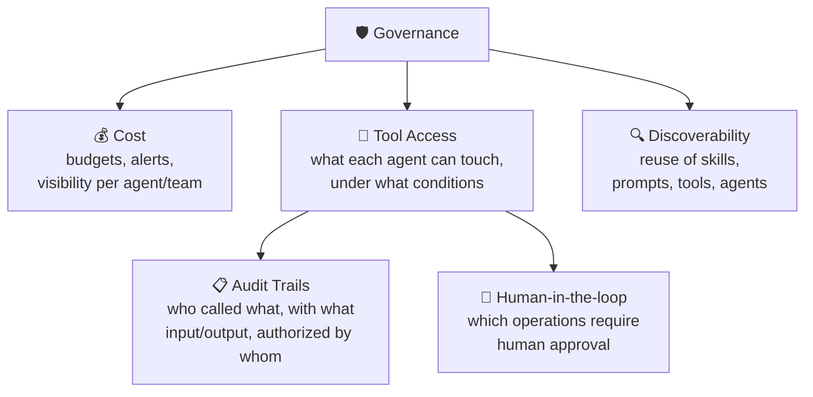

# 🛡️ Governance

[← Monitor](04-monitor.md) · [Back to index](../README.md) · Next: [☁️ AWS Mapping →](06-aws-mapping.md)

## The core idea

Governance is not another phase of the cycle — it wraps the other four. For a single agent, light controls are usually enough: the team that built it knows what it does, how much it costs and what it has access to. The problem appears when the organization starts deploying **many** agents at once. Without governance, that quickly turns into agents that are hard to discover, hard to monitor, expensive to operate, and unclear in what they are allowed to do.

Good governance does not exist to slow teams down. It exists so that rapid iteration remains possible **without losing visibility, control or consistency** as the number of agents grows.

## Cost — the first governance challenge

Agents can become expensive for reasons that are not always obvious at first: multiple model calls per task, long context windows, repeated tool use, retries, or tasks that simply run for a long time. A single "simple" task can hide dozens of model calls if the agent iterates enough.

The organization needs ways to track and manage that spend: budgets, usage monitoring, alerts, and visibility into **which agents, teams, models or tools** are generating the cost. Without this granular visibility, "AI spend went up" says nothing useful about what to do about it.

## Tool Access — the second challenge

Agents are useful precisely because they can **act**, not just respond. That introduces real risk: clear control is needed over which tools an agent can use, under what conditions, and on behalf of which user.

### Audit trails

If an agent calls a tool, the organization must be able to inspect: which agent made the call, what inputs it used, what outputs it produced, and which user or policy authorized that action. Tool calls are almost always the point where agent behavior has real business impact — that is why they need to be observable and reviewable, not a black box.

### Human-in-the-loop

Not every tool call should be fully automated. Some operations should pause for human review — especially when they involve customers, financial systems, sensitive data, or production infrastructure. Human-in-the-loop works best when it is designed **from the beginning** of the system, not patched in after an incident.

> Direct connection to [Deploy → Runtime](03-deploy.md#runtime--the-foundation-of-execution): the ability to pause and resume reliably is what makes human-in-the-loop viable in practice, rather than a promise that breaks on the first network failure.

## Discoverability — the third challenge

As an organization builds more agents, it also accumulates more reusable assets: prompts, skills, tools, retrieval sources, policies, and even other agents. Without good discovery and governance mechanisms, teams tend to **rebuild these components over and over**, leading to inconsistency — different teams solving the same problem in different ways, with different quality.

This matters especially for **skills**: a skill can encapsulate a workflow, a writing style, a specific domain procedure, or instructions for using a specific tool. If one team already built a good skill, another team should be able to **find and reuse it** rather than write their own version from scratch.

> Direct connection to [Deploy → Context Hub](03-deploy.md#context-hub--managing-prompts-and-context-separately-from-code): the context hub is, among other things, the infrastructure that makes discoverability possible — without a central, versioned place where skills and prompts live, there is nothing to "discover".

## Key decisions

1. **Can I know, right now, how much each individual agent is spending?** If not, granularity in cost tracking is missing — and that usually means spend rises without anyone noticing until the bill arrives.
2. **What would happen if this agent called the wrong tool in production?** If the answer is frightening, that tool needs either stricter access restrictions or a human approval step before it executes.
3. **Can I reconstruct, for any tool call in the past 30 days, who authorized it and with what input?** If not, the audit trail has gaps.
4. **Is this team about to rewrite a skill that already exists somewhere else in the organization?** Before writing new code, I check the shared context/skill repository.
5. **Does the governance I'm adding slow down iteration, or does it only add visibility?** If it slows down without adding real control, it is probably badly designed — the goal is visibility without friction, not bureaucracy.

## AWS Connection

- **Cost** → usage and invocation metrics per resource in **CloudWatch** (namespace `Bedrock-AgentCore`), combined with **AWS Cost Explorer** and tags per agent/team/project at account or resource level for spend attribution. For hard limits, **AWS Budgets** with alerts.
- **Tool Access + Audit Trails** → **AgentCore Identity** manages which credentials and permissions the agent delegates when calling external services (OAuth) or AWS resources, with scoped access and secure permission delegation. The **AgentCore Gateway** and **AgentCore Runtime** logs in CloudWatch include `request_id`, `trace_id` and `span_id`, making it possible to reconstruct which agent called which tool, with what input/output. **AWS IAM** remains the base access control layer (resource-based policies for evaluators/gateways, identity-based policies for users and roles).
- **Human-in-the-loop** → natively supported in orchestration runtimes (LangGraph, or AgentCore Runtime itself via session pauses); for more traditional approval flows, this is usually integrated with task queues or notifications (SQS/SNS) to a review system.
- **Discoverability** → **AgentCore Agent Registry** (in preview as of this note): a single place to discover, share and reuse agents, tools and skills within the organization, with integrated approval flows and search — the most direct AWS equivalent to the discoverability idea described above.
- **Behavioral guardrails** → **AgentCore Policy**, which gives control over what actions an agent can take, helping keep it within defined boundaries without slowing development speed — it complements the audit trail (which is retrospective) with preventive control (which acts before the action occurs).

## References

- LangChain — [The Agent Development Lifecycle](https://www.langchain.com/blog/the-agent-development-lifecycle)
- AWS — [Amazon Bedrock AgentCore FAQs](https://aws.amazon.com/bedrock/agentcore/faqs/)
- AWS — [AgentCore generated gateway observability data](https://docs.aws.amazon.com/bedrock-agentcore/latest/devguide/observability-gateway-metrics.html)
