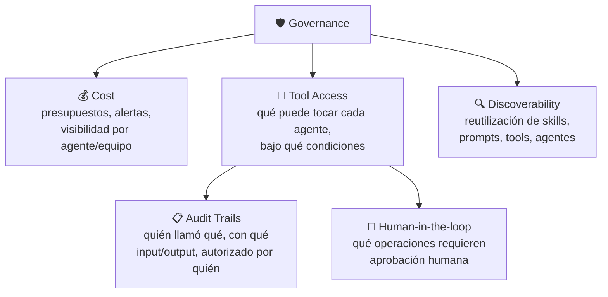

# 🛡️ Governance

[← Monitor](04-monitor.md) · [Volver al índice](../README.md) · Siguiente: [☁️ AWS Mapping →](06-aws-mapping.md)

## La idea central

La gobernanza no es una fase más del ciclo — envuelve a las otras cuatro. Para un solo agente, unos controles ligeros suelen bastar: el equipo que lo construyó sabe qué hace, cuánto cuesta y a qué tiene acceso. El problema aparece cuando la organización empieza a desplegar **muchos** agentes a la vez. Sin gobernanza, eso se convierte rápido en agentes difíciles de descubrir, difíciles de monitorizar, caros de operar, y poco claros en lo que tienen permitido hacer.

La gobernanza bien hecha no existe para frenar la velocidad de los equipos. Existe para que la iteración rápida sea posible **sin perder visibilidad, control o consistencia** a medida que el número de agentes crece.

## Cost — el primer reto de gobernanza

Los agentes pueden volverse caros por razones que no siempre son obvias al principio: múltiples llamadas al modelo por tarea, ventanas de contexto largas, uso repetido de herramientas, reintentos, o tareas que simplemente corren durante mucho tiempo. Una sola tarea "simple" puede esconder docenas de llamadas a modelo si el agente itera lo suficiente.

La organización necesita formas de rastrear y gestionar ese gasto: presupuestos, monitorización de uso, alertas, y visibilidad sobre **qué agentes, equipos, modelos o herramientas** están generando el coste. Sin esta visibilidad granular, "el gasto en IA subió" no dice nada útil sobre qué hacer al respecto.

## Tool Access — el segundo reto

Los agentes son útiles precisamente porque pueden **actuar**, no solo responder. Eso introduce riesgo real: hace falta control claro sobre qué herramientas puede usar un agente, bajo qué condiciones, y en nombre de qué usuario.

### Audit trails

Si un agente llama a una herramienta, la organización tiene que poder inspeccionar: qué agente hizo la llamada, qué inputs usó, qué outputs produjo, y qué usuario o política autorizó esa acción. Las llamadas a herramientas son, casi siempre, el punto donde el comportamiento del agente tiene impacto real en el negocio — por eso necesitan ser observables y revisables, no una caja negra.

### Human-in-the-loop

No toda llamada a herramienta debería automatizarse por completo. Algunas operaciones deberían pausarse para revisión humana — especialmente cuando involucran clientes, sistemas financieros, datos sensibles, o infraestructura de producción. El human-in-the-loop funciona mejor cuando se diseña **desde el principio** del sistema, no como un parche añadido después de un incidente.

> Conexión directa con [Deploy → Runtime](03-deploy.md#runtime--la-base-de-la-ejecución): la capacidad de pausar y reanudar de forma fiable es lo que hace que el human-in-the-loop sea viable en la práctica, en lugar de una promesa que se rompe en el primer fallo de red.

## Discoverability — el tercer reto

A medida que una organización construye más agentes, también acumula más activos reutilizables: prompts, skills, herramientas, fuentes de retrieval, políticas, e incluso otros agentes. Sin buenos mecanismos de descubrimiento y gobernanza, los equipos tienden a **reconstruir estos componentes una y otra vez**, lo que lleva a inconsistencia — distintos equipos resolviendo el mismo problema de formas distintas, con distinta calidad.

Esto importa especialmente para **skills**: una skill puede encapsular un flujo de trabajo, un estilo de escritura, un procedimiento específico de dominio, o instrucciones para usar una herramienta concreta. Si un equipo ya construyó una skill buena, otro equipo debería poder **encontrarla y reutilizarla** en lugar de escribir su propia versión desde cero.

> Conexión directa con [Deploy → Context Hub](03-deploy.md#context-hub--gestionar-prompts-y-contexto-como-un-sistema-aparte-del-código): el context hub es, entre otras cosas, la infraestructura que hace posible la discoverability — sin un sitio central y versionado donde vivan las skills y prompts, no hay nada que "descubrir".

## Preguntas para decidir

1. **¿Puedo saber, hoy mismo, cuánto está gastando cada agente individual?** Si no, falta granularidad en el tracking de coste — y eso suele significar que el gasto sube sin que nadie lo note hasta la factura.
2. **¿Qué pasaría si este agente llamara a la herramienta equivocada en producción?** Si la respuesta da miedo, esa herramienta necesita o bien restricciones más estrictas de acceso, o bien un paso de aprobación humana antes de ejecutarse.
3. **¿Puedo reconstruir, para cualquier llamada a herramienta de los últimos 30 días, quién la autorizó y con qué input?** Si no, el audit trail tiene huecos.
4. **¿Este equipo está a punto de reescribir una skill que ya existe en otro lado de la organización?** Antes de escribir código nuevo, busco en el repositorio compartido de contexto/skills.
5. **¿La gobernanza que estoy añadiendo ralentiza la iteración, o solo añade visibilidad?** Si ralentiza sin añadir control real, probablemente está mal diseñada — el objetivo es visibilidad sin fricción, no burocracia.

## Conexión con AWS

- **Cost** → métricas de uso e invocación por recurso en **CloudWatch** (namespace `Bedrock-AgentCore`), combinadas con **AWS Cost Explorer** y tags por agente/equipo/proyecto a nivel de cuenta o de recurso para atribuir gasto. Para límites duros, **AWS Budgets** con alertas.
- **Tool Access + Audit Trails** → **AgentCore Identity** gestiona qué credenciales y permisos delega el agente al llamar a servicios externos (OAuth) o recursos AWS, con acceso de alcance limitado (*scoped access*) y delegación segura de permisos. Los logs de **AgentCore Gateway** y **AgentCore Runtime** en CloudWatch incluyen `request_id`, `trace_id` y `span_id`, lo que permite reconstruir qué agente llamó qué herramienta, con qué input/output. **AWS IAM** sigue siendo la capa base de control de acceso (políticas basadas en recursos para los evaluadores/gateways, políticas basadas en identidad para usuarios y roles).
- **Human-in-the-loop** → soportado de forma nativa en los runtimes de orquestación (LangGraph, o el propio AgentCore Runtime vía pausas de sesión); para flujos de aprobación más tradicionales, esto se suele integrar con colas de tareas o notificaciones (SQS/SNS) hacia un sistema de revisión.
- **Discoverability** → **AgentCore Agent Registry** (en preview a fecha de esta nota): un sitio único para descubrir, compartir y reutilizar agentes, herramientas y skills dentro de la organización, con flujos de aprobación y búsqueda integrados — el equivalente más directo a la idea de discoverability descrita arriba.
- **Guardrails de comportamiento** → **AgentCore Policy**, que da control sobre qué acciones puede tomar un agente, ayudando a mantenerlo dentro de límites definidos sin frenar la velocidad de desarrollo — complementa el audit trail (que es retrospectivo) con control preventivo (que actúa antes de que la acción ocurra).

## Referencias

- LangChain — [The Agent Development Lifecycle](https://www.langchain.com/blog/the-agent-development-lifecycle)
- AWS — [Amazon Bedrock AgentCore FAQs](https://aws.amazon.com/bedrock/agentcore/faqs/)
- AWS — [AgentCore generated gateway observability data](https://docs.aws.amazon.com/bedrock-agentcore/latest/devguide/observability-gateway-metrics.html)
